# TradeDash Architecture Diagrams

This document provides visual diagrams to illustrate the TradeDash system architecture.

---

## 1. High-Level System Architecture

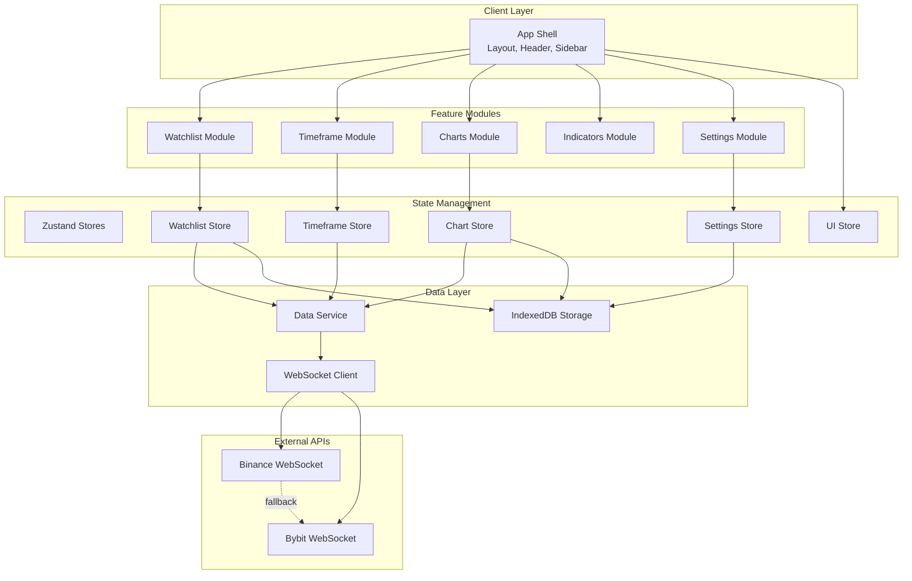

---

## 2. Component Hierarchy

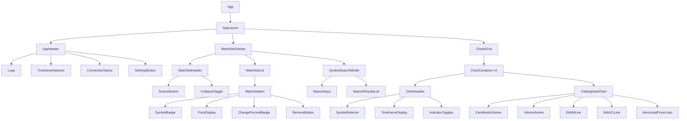

---

## 3. Data Flow - Symbol Selection

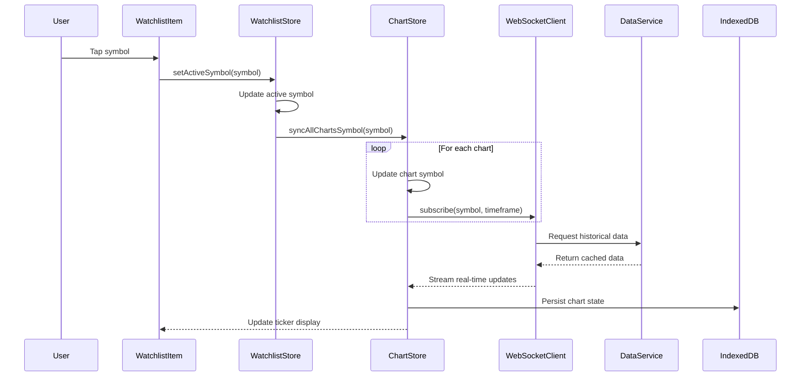

---

## 4. Data Flow - Timeframe Change

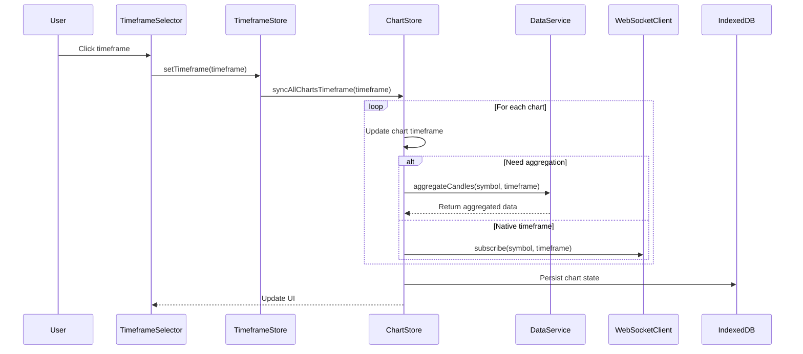

---

## 5. Data Flow - Horizontal Lines

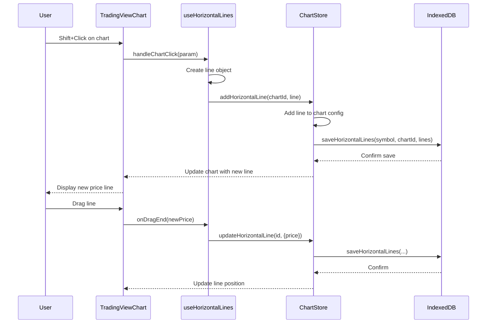

---

## 6. Store Dependencies

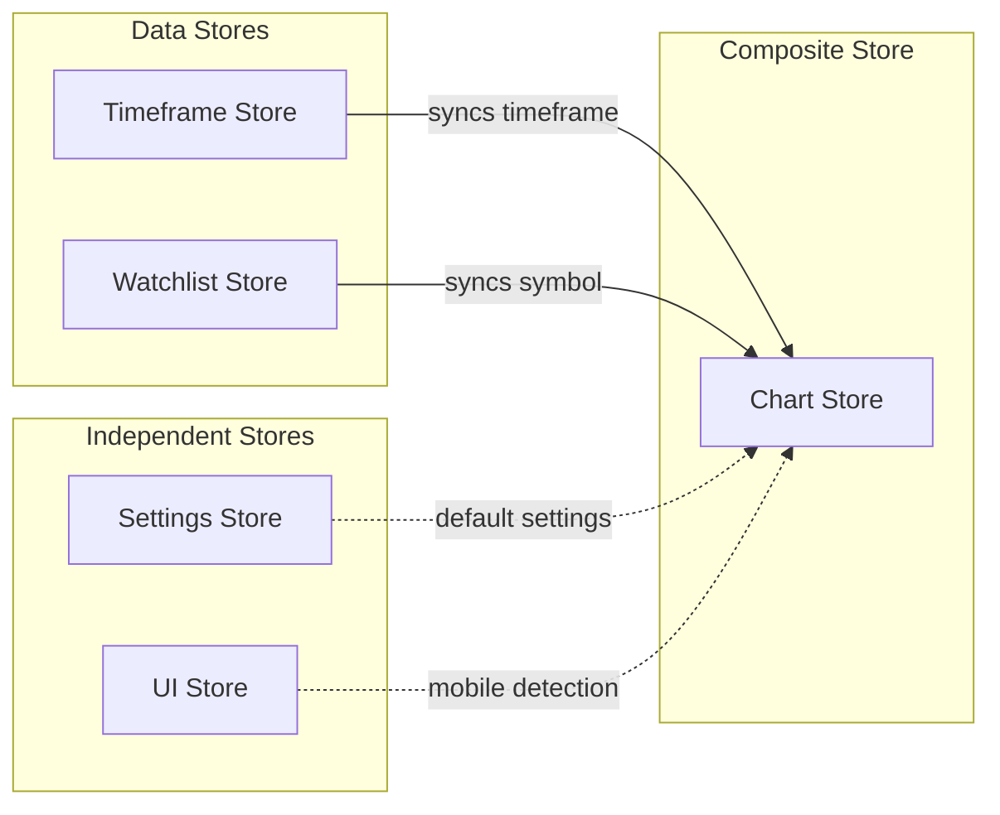

---

## 7. WebSocket Connection Lifecycle

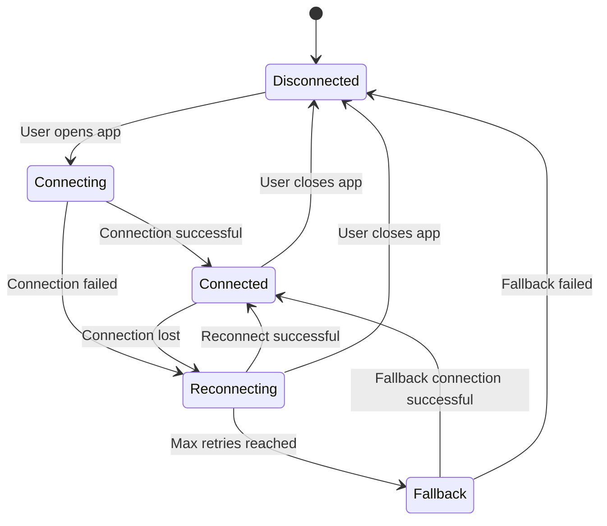

---

## 8. Persistence Strategy

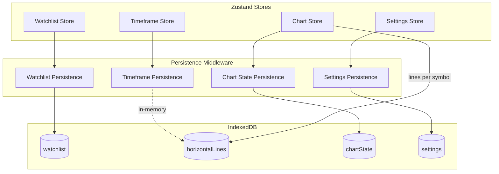

---

## 9. Responsive Layout States

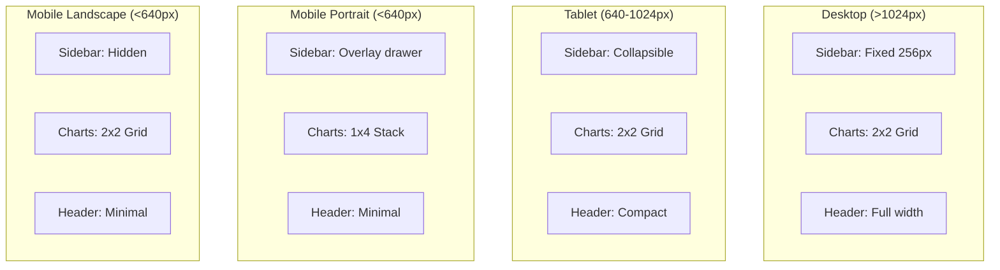

---

## 10. Module File Structure

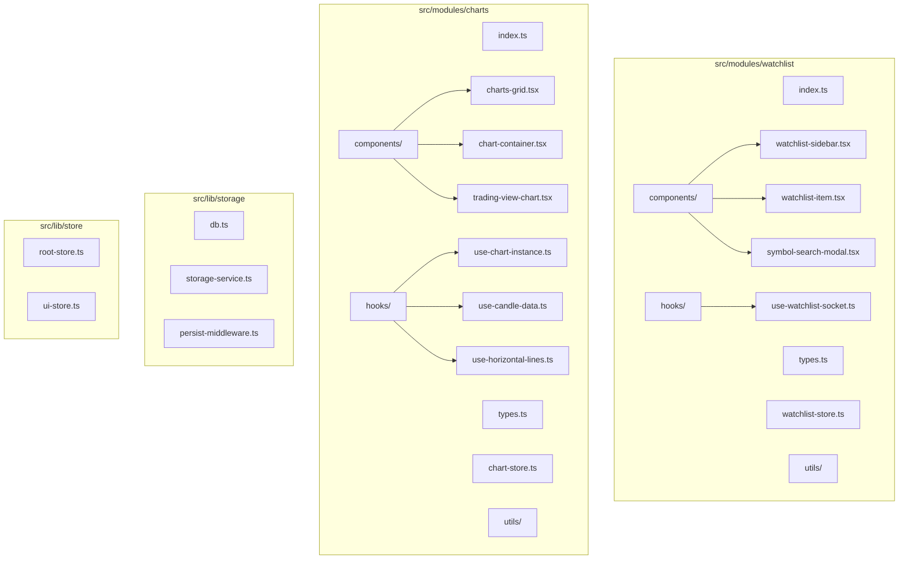

---

## 11. Package Dependencies

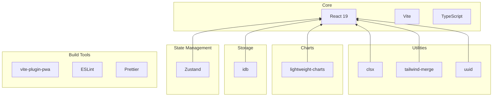
