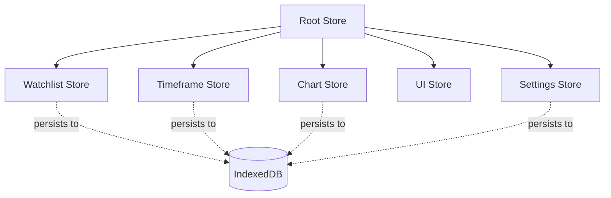
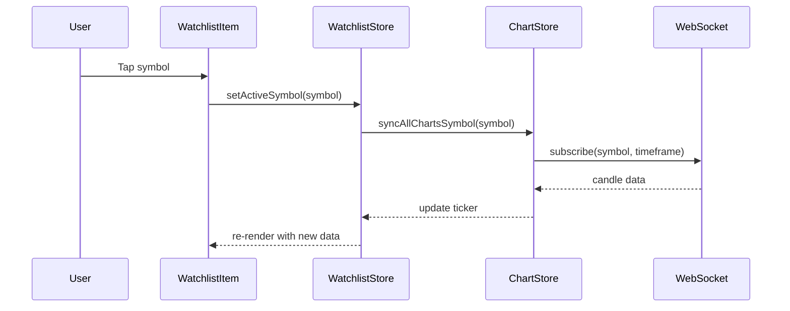
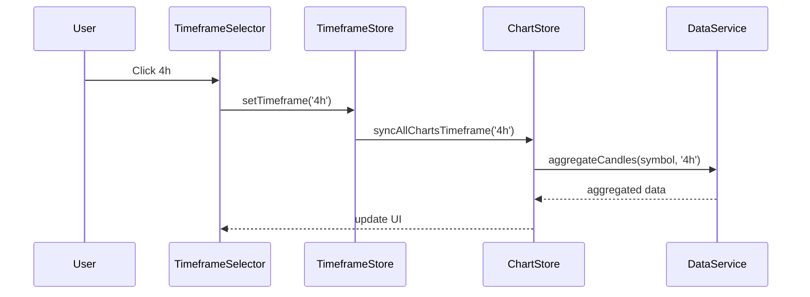
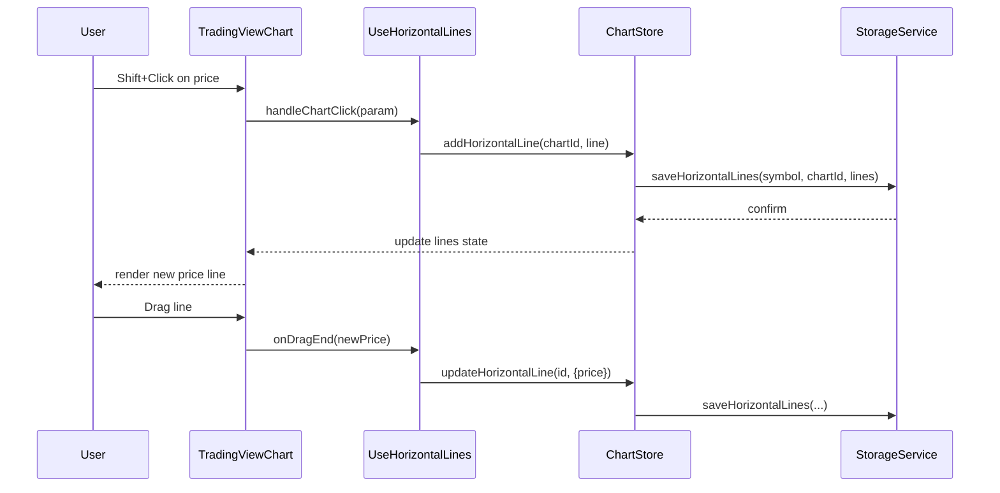

# TradeDash MVP Implementation Plan

## Executive Summary

This document provides a comprehensive implementation plan for the remaining TradeDash MVP features. The project is a React 19 + Vite + TypeScript PWA for cryptocurrency trading charts with real-time WebSocket data from Binance/Bybit.

---

## Current State Analysis

### What's Already Implemented

- WebSocket client with Binance/Bybit support, auto-reconnection, fallback logic
- Data service with in-memory caching, candle aggregation, EMA/RSI calculations
- React hooks for WebSocket consumption (`useWebSocket`)
- TypeScript types for all data structures
- PWA configuration with Vite PWA plugin
- Environment configuration

### Project Structure

```
src/
├── app/                    # App shell, main entry
├── lib/
│   ├── config/            # Environment config
│   ├── data/              # WebSocket, data service, types
│   └── storage/           # [EMPTY - needs IndexedDB]
└── modules/
    ├── charts/            # [EMPTY - needs implementation]
    ├── indicators/        # [EMPTY - needs implementation]
    ├── settings/          # [EMPTY - needs implementation]
    ├── timeframe/         # [EMPTY - needs implementation]
    └── watchlist/         # [EMPTY - needs implementation]
```

---

## 1. State Management Architecture (Zustand)

### Store Design Philosophy

- **Colocation**: Stores live next to their feature modules
- **Composition**: Root store composes feature stores
- **Persistence**: Selective persistence via middleware
- **Type Safety**: Full TypeScript support

### Store Hierarchy



### Store Schemas

#### 1.1 Watchlist Store (`src/modules/watchlist/watchlist-store.ts`)

```typescript
interface WatchlistState {
  // State
  symbols: string[];                    // e.g., ['BTCUSDT', 'ETHUSDT', ...]
  activeSymbol: string;                 // Currently selected symbol
  tickers: Record<string, NormalizedTicker>; // Real-time ticker data

  // Actions
  addSymbol: (symbol: string) => void;
  removeSymbol: (symbol: string) => void;
  setActiveSymbol: (symbol: string) => void;
  updateTicker: (ticker: NormalizedTicker) => void;
  reorderSymbols: (symbols: string[]) => void;
}

// Initial state
{
  symbols: ['BTCUSDT', 'ETHUSDT', 'SOLUSDT', 'DOGEUSDT'],
  activeSymbol: 'BTCUSDT',
  tickers: {}
}
```

#### 1.2 Timeframe Store (`src/modules/timeframe/timeframe-store.ts`)

```typescript
type Timeframe = '15m' | '1h' | '4h' | '8h';

interface TimeframeState {
  // State
  currentTimeframe: Timeframe;
  availableTimeframes: Timeframe[];

  // Actions
  setTimeframe: (timeframe: Timeframe) => void;
}

// Initial state
{
  currentTimeframe: '1h',
  availableTimeframes: ['15m', '1h', '4h', '8h']
}
```

#### 1.3 Chart Store (`src/modules/charts/chart-store.ts`)

```typescript
interface ChartConfig {
  id: string; // 'chart-1', 'chart-2', 'chart-3', 'chart-4'
  symbol: string; // Symbol for this chart
  timeframe: Timeframe; // Synced with global timeframe
  indicators: {
    ema9: boolean;
    ema21: boolean;
  };
  horizontalLines: HorizontalLine[];
}

interface ChartState {
  // State
  charts: ChartConfig[];

  // Actions
  setChartSymbol: (chartId: string, symbol: string) => void;
  setChartTimeframe: (chartId: string, timeframe: Timeframe) => void;
  toggleIndicator: (chartId: string, indicator: 'ema9' | 'ema21') => void;
  addHorizontalLine: (chartId: string, line: HorizontalLine) => void;
  removeHorizontalLine: (chartId: string, lineId: string) => void;
  updateHorizontalLine: (
    chartId: string,
    lineId: string,
    updates: Partial<HorizontalLine>
  ) => void;
  syncAllChartsTimeframe: (timeframe: Timeframe) => void;
  syncAllChartsSymbol: (symbol: string) => void; // Tap-to-sync from watchlist
}

// Initial state
{
  charts: [
    {
      id: 'chart-1',
      symbol: 'BTCUSDT',
      timeframe: '1h',
      indicators: { ema9: true, ema21: true },
      horizontalLines: [],
    },
    {
      id: 'chart-2',
      symbol: 'BTCUSDT',
      timeframe: '1h',
      indicators: { ema9: true, ema21: true },
      horizontalLines: [],
    },
    {
      id: 'chart-3',
      symbol: 'BTCUSDT',
      timeframe: '1h',
      indicators: { ema9: true, ema21: true },
      horizontalLines: [],
    },
    {
      id: 'chart-4',
      symbol: 'BTCUSDT',
      timeframe: '1h',
      indicators: { ema9: true, ema21: true },
      horizontalLines: [],
    },
  ];
}
```

#### 1.4 UI Store (`src/modules/ui/ui-store.ts`)

```typescript
interface UIState {
  // State
  sidebarOpen: boolean;
  activeModal: string | null;
  isMobile: boolean;
  connectionStatus: 'connected' | 'disconnected' | 'reconnecting';

  // Actions
  toggleSidebar: () => void;
  setSidebarOpen: (open: boolean) => void;
  setActiveModal: (modal: string | null) => void;
  setIsMobile: (isMobile: boolean) => void;
  setConnectionStatus: (status: UIState['connectionStatus']) => void;
}

// Initial state
{
  sidebarOpen: true,  // Closed on mobile by default
  activeModal: null,
  isMobile: false,
  connectionStatus: 'disconnected'
}
```

#### 1.5 Settings Store (`src/modules/settings/settings-store.ts`)

```typescript
interface SettingsState {
  // State
  chartSettings: {
    candleType: 'candlestick' | 'heikinashi';
    showVolume: boolean;
    priceScaleMode: 'normal' | 'logarithmic';
  };
  indicatorDefaults: {
    ema9: { color: string; width: number };
    ema21: { color: string; width: number };
  };

  // Actions
  updateChartSettings: (settings: Partial<SettingsState['chartSettings']>) => void;
  updateIndicatorDefaults: (indicator: string, settings: Record<string, unknown>) => void;
}

// Initial state
{
  chartSettings: {
    candleType: 'candlestick',
    showVolume: true,
    priceScaleMode: 'normal'
  },
  indicatorDefaults: {
    ema9: { color: '#2196F3', width: 2 },
    ema21: { color: '#FF9800', width: 2 }
  }
}
```

#### 1.6 Root Store (`src/lib/store/root-store.ts`)

```typescript
// Composes all stores and provides unified interface
export const useRootStore = () => ({
  watchlist: useWatchlistStore(),
  timeframe: useTimeframeStore(),
  charts: useChartStore(),
  ui: useUIStore(),
  settings: useSettingsStore(),
});
```

---

## 2. Storage Layer (IndexedDB)

### Schema Design

Using `idb` package for ergonomic IndexedDB access.

```typescript
// src/lib/storage/db.ts

import { openDB, DBSchema } from 'idb';

interface TradeDashDB extends DBSchema {
  // Store: Watchlist symbols
  watchlist: {
    key: string;
    value: {
      symbols: string[];
      activeSymbol: string;
      lastUpdated: number;
    };
  };

  // Store: Horizontal lines per symbol
  horizontalLines: {
    key: string; // `${symbol}_${chartId}`
    value: {
      symbol: string;
      chartId: string;
      lines: HorizontalLine[];
      lastUpdated: number;
    };
    indexes: {
      'by-symbol': string;
    };
  };

  // Store: User settings
  settings: {
    key: string;
    value: {
      chartSettings: ChartSettings;
      indicatorDefaults: IndicatorDefaults;
      lastUpdated: number;
    };
  };

  // Store: Last viewed symbols per chart
  chartState: {
    key: string; // chartId
    value: {
      chartId: string;
      symbol: string;
      indicators: { ema9: boolean; ema21: boolean };
      lastUpdated: number;
    };
  };
}

const DB_NAME = 'TradeDashDB';
const DB_VERSION = 1;

export const initDB = () =>
  openDB<TradeDashDB>(DB_NAME, DB_VERSION, {
    upgrade(db) {
      // Watchlist store
      db.createObjectStore('watchlist', { keyPath: 'id' });

      // Horizontal lines store
      const linesStore = db.createObjectStore('horizontalLines', {
        keyPath: 'key',
      });
      linesStore.createIndex('by-symbol', 'symbol');

      // Settings store
      db.createObjectStore('settings', { keyPath: 'id' });

      // Chart state store
      db.createObjectStore('chartState', { keyPath: 'chartId' });
    },
  });
```

### Storage Service API

```typescript
// src/lib/storage/storage-service.ts

export const StorageService = {
  // Watchlist
  saveWatchlist: (data: WatchlistData) => Promise<void>;
  loadWatchlist: () => Promise<WatchlistData | null>;

  // Horizontal Lines
  saveHorizontalLines: (symbol: string, chartId: string, lines: HorizontalLine[]) => Promise<void>;
  loadHorizontalLines: (symbol: string, chartId: string) => Promise<HorizontalLine[]>;
  deleteHorizontalLines: (symbol: string, chartId: string) => Promise<void>;

  // Settings
  saveSettings: (settings: SettingsData) => Promise<void>;
  loadSettings: () => Promise<SettingsData | null>;

  // Chart State
  saveChartState: (chartId: string, state: ChartState) => Promise<void>;
  loadChartState: (chartId: string) => Promise<ChartState | null>;
  loadAllChartStates: () => Promise<ChartState[]>;
};
```

### Zustand Persistence Middleware

```typescript
// src/lib/store/persist-middleware.ts

export const createPersistMiddleware = <T>(
  storeName: string,
  storageKey: string,
  serialize: (state: T) => unknown,
  deserialize: (data: unknown) => Partial<T>
) => {
  return (config: StateCreator<T>) => (set, get, api) => {
    const store = config(
      (args) => {
        set(args);
        // Persist after state change
        const state = get();
        StorageService.save(storageKey, serialize(state));
      },
      get,
      api
    );

    // Hydrate on init
    StorageService.load(storageKey).then((data) => {
      if (data) {
        set(deserialize(data));
      }
    });

    return store;
  };
};
```

---

## 3. Watchlist Module

### Component Hierarchy

```
WatchlistSidebar
├── WatchlistHeader
│   ├── SearchButton (opens SymbolSearchModal)
│   └── CollapseToggle
├── WatchlistList
│   └── WatchlistItem (for each symbol)
│       ├── SymbolBadge
│       ├── PriceDisplay
│       ├── ChangePercentBadge
│       └── RemoveButton (on hover)
└── SymbolSearchModal
    ├── SearchInput
    ├── SearchResultsList
    │   └── SearchResultItem
    └── PopularSymbolsGrid
```

### Component Interfaces

```typescript
// src/modules/watchlist/types.ts

interface WatchlistItemProps {
  symbol: string;
  ticker: NormalizedTicker | undefined;
  isActive: boolean;
  onClick: () => void;
  onRemove: () => void;
}

interface SymbolSearchModalProps {
  isOpen: boolean;
  onClose: () => void;
  onSelect: (symbol: string) => void;
  existingSymbols: string[];
}

interface SymbolSearchResult {
  symbol: string;
  baseAsset: string;
  quoteAsset: string;
  popularity: number;
}
```

### Data Flow



### File Structure

```
src/modules/watchlist/
├── index.ts                    # Public exports
├── types.ts                    # Module types
├── watchlist-store.ts          # Zustand store
├── components/
│   ├── watchlist-sidebar.tsx
│   ├── watchlist-header.tsx
│   ├── watchlist-list.tsx
│   ├── watchlist-item.tsx
│   ├── symbol-search-modal.tsx
│   └── symbol-search-input.tsx
├── hooks/
│   └── use-watchlist-socket.ts # Subscribe to ticker updates
└── utils/
    └── symbol-search.ts        # Search/filter logic
```

---

## 4. Timeframe Control Module

### Component Design

```typescript
// src/modules/timeframe/types.ts

type Timeframe = '15m' | '1h' | '4h' | '8h';

interface TimeframeSelectorProps {
  currentTimeframe: Timeframe;
  onTimeframeChange: (timeframe: Timeframe) => void;
  availableTimeframes: Timeframe[];
}

interface TimeframeButtonProps {
  timeframe: Timeframe;
  isActive: boolean;
  onClick: () => void;
}
```

### Visual Design

- **Desktop**: Horizontal button group in header
- **Mobile**: Dropdown/select or segmented control
- **Active State**: Highlighted background, bold text
- **Sync Indicator**: Small dot when all charts synced

### Data Flow



### File Structure

```
src/modules/timeframe/
├── index.ts
├── types.ts
├── timeframe-store.ts
└── components/
    ├── timeframe-selector.tsx
    └── timeframe-button.tsx
```

---

## 5. Charts Module (2x2 Grid + TradingView)

### Component Hierarchy

```
ChartsGrid
├── ChartContainer (x4)
│   ├── ChartHeader
│   │   ├── SymbolSelector (dropdown)
│   │   ├── TimeframeDisplay
│   │   └── IndicatorToggles
│   ├── TradingViewChart
│   │   ├── CandlestickSeries
│   │   ├── VolumeSeries
│   │   ├── EMA9Line (optional)
│   │   ├── EMA21Line (optional)
│   │   └── HorizontalPriceLines
│   └── ChartToolbar (mobile only)
└── GridResizeHandle (desktop only)
```

### TradingView Lightweight Charts Integration

```typescript
// src/modules/charts/types.ts

import { ISeriesApi, IChartApi, CandlestickData } from 'lightweight-charts';

interface ChartInstance {
  chart: IChartApi;
  candlestickSeries: ISeriesApi<'Candlestick'>;
  volumeSeries?: ISeriesApi<'Histogram'>;
  ema9Series?: ISeriesApi<'Line'>;
  ema21Series?: ISeriesApi<'Line'>;
  priceLines: Map<string, IPriceLine>;
}

interface ChartProps {
  chartId: string;
  symbol: string;
  timeframe: Timeframe;
  indicators: { ema9: boolean; ema21: boolean };
  horizontalLines: HorizontalLine[];
  onSymbolChange: (symbol: string) => void;
  onHorizontalLineAdd: (price: number) => void;
  onHorizontalLineMove: (lineId: string, price: number) => void;
  onHorizontalLineRemove: (lineId: string) => void;
}
```

### Chart Configuration

```typescript
// src/modules/charts/chart-config.ts

export const CHART_CONFIG = {
  // Layout
  gridColumns: 2,
  gridRows: 2,
  gap: 4, // pixels

  // Chart options
  defaultOptions: {
    layout: {
      background: { color: '#1a1a1a' },
      textColor: '#d1d4dc',
    },
    grid: {
      vertLines: { color: '#2a2a2a' },
      horzLines: { color: '#2a2a2a' },
    },
    crosshair: {
      mode: CrosshairMode.Normal,
    },
    rightPriceScale: {
      borderColor: '#2a2a2a',
    },
    timeScale: {
      borderColor: '#2a2a2a',
      timeVisible: true,
    },
  },

  // Candle colors
  upColor: '#26a69a',
  downColor: '#ef5350',
  borderUpColor: '#26a69a',
  borderDownColor: '#ef5350',
  wickUpColor: '#26a69a',
  wickDownColor: '#ef5350',
};
```

### Responsive Grid Layout

```typescript
// src/modules/charts/components/charts-grid.tsx

// Desktop: 2x2 grid with resizable panels
// Mobile: 2x2 grid with fixed ratio, scrollable if needed
// Portrait: Stack vertically or 2x2 with smaller charts

const gridVariants = {
  desktop: 'grid-cols-2 grid-rows-2 h-screen',
  mobileLandscape: 'grid-cols-2 grid-rows-2 h-[100vw]',
  mobilePortrait: 'grid-cols-1 grid-rows-4',
};
```

### File Structure

```
src/modules/charts/
├── index.ts
├── types.ts
├── chart-store.ts
├── chart-config.ts
├── hooks/
│   ├── use-chart-instance.ts
│   ├── use-candle-data.ts
│   └── use-horizontal-lines.ts
├── components/
│   ├── charts-grid.tsx
│   ├── chart-container.tsx
│   ├── chart-header.tsx
│   ├── trading-view-chart.tsx
│   ├── symbol-selector.tsx
│   └── indicator-toggle.tsx
└── utils/
    ├── chart-helpers.ts
    └── price-formatters.ts
```

---

## 6. Indicators Module

### Design

```typescript
// src/modules/indicators/types.ts

interface IndicatorConfig {
  id: string;
  name: string;
  type: 'overlay' | 'oscillator';
  defaultVisible: boolean;
  options: Record<string, unknown>;
}

interface EMAConfig extends IndicatorConfig {
  period: number;
  color: string;
  width: number;
}

interface IndicatorToggleProps {
  indicator: 'ema9' | 'ema21';
  isActive: boolean;
  onToggle: () => void;
}
```

### EMA Calculation Integration

EMA data is calculated in `DataService` and passed to charts as line series:

```typescript
// In chart component
useEffect(() => {
  if (indicators.ema9 && candleData.length > 9) {
    const ema9Data = DataService.getEMA(symbol, timeframe, 9);
    ema9Series.setData(ema9Data);
  }
}, [indicators.ema9, candleData]);
```

### File Structure

```
src/modules/indicators/
├── index.ts
├── types.ts
└── components/
    └── indicator-toggles.tsx
```

---

## 7. Horizontal Lines Feature

### Design

```typescript
// src/modules/charts/types.ts (additions)

interface HorizontalLine {
  id: string;
  price: number;
  color: string;
  width: number;
  style: LineStyle;
  label: string;
  draggable: boolean;
}

interface UseHorizontalLinesReturn {
  lines: HorizontalLine[];
  addLine: (price: number) => void;
  removeLine: (id: string) => void;
  updateLine: (id: string, updates: Partial<HorizontalLine>) => void;
  handleChartClick: (param: MouseEventParams) => void;
}
```

### Interaction Flow



### User Interactions

| Action      | Trigger                   | Result                                |
| ----------- | ------------------------- | ------------------------------------- |
| Add line    | Shift+Click on chart      | Creates horizontal line at Y position |
| Move line   | Drag line handle          | Updates line price                    |
| Remove line | Right-click line → Delete | Removes line                          |
| Edit label  | Double-click label        | Opens label editor                    |

---

## 8. App Shell / UI Layout

### Layout Structure

```
App
├── AppHeader (fixed top)
│   ├── Logo
│   ├── TimeframeSelector
│   ├── ConnectionStatus
│   └── SettingsButton
├── AppLayout
│   ├── WatchlistSidebar (collapsible)
│   └── ChartsGrid (main content)
└── Modals
    ├── SymbolSearchModal
    └── SettingsModal
```

### Responsive Breakpoints

```typescript
// src/lib/config/breakpoints.ts

export const BREAKPOINTS = {
  mobile: 640, // < 640px: Single column, collapsed sidebar
  tablet: 1024, // 640-1024px: 2x2 grid, collapsible sidebar
  desktop: 1280, // > 1024px: Full layout, resizable
};

// Tailwind classes
const layoutClasses = {
  sidebar: {
    mobile:
      'fixed inset-y-0 left-0 z-50 w-64 transform -translate-x-full transition-transform',
    open: 'translate-x-0',
  },
  main: {
    mobile: 'ml-0',
    desktop: 'ml-64',
  },
};
```

### Dark Mode (Only)

```css
/* src/app/index.css */

:root {
  --bg-primary: #0a0a0a;
  --bg-secondary: #1a1a1a;
  --bg-tertiary: #2a2a2a;
  --text-primary: #ffffff;
  --text-secondary: #a0a0a0;
  --accent-primary: #3b82f6;
  --accent-success: #22c55e;
  --accent-danger: #ef4444;
}
```

### File Structure

```
src/app/
├── main.tsx
├── App.tsx
├── App.css
├── index.css
├── components/
│   ├── app-header.tsx
│   ├── app-layout.tsx
│   ├── app-sidebar.tsx
│   └── connection-status.tsx
└── hooks/
    └── use-mobile-detect.ts
```

---

## 9. Implementation Order Recommendation

### Phase 1: Foundation (Week 1)

1. **Install Dependencies**
   - `zustand` - State management
   - `idb` - IndexedDB wrapper
   - `lightweight-charts` - TradingView charts
   - `clsx`, `tailwind-merge` - Utility classes

2. **Storage Layer**
   - Create `src/lib/storage/db.ts` - IndexedDB schema
   - Create `src/lib/storage/storage-service.ts` - CRUD operations
   - Create persistence middleware for Zustand

3. **State Management**
   - Create `src/lib/store/` directory
   - Implement UI store (sidebar state, mobile detection)
   - Implement Settings store with persistence

### Phase 2: Core UI (Week 1-2)

4. **App Shell**
   - Create `AppLayout` component
   - Implement responsive sidebar
   - Add dark mode styles
   - Add connection status indicator

5. **Timeframe Module**
   - Create timeframe store with persistence
   - Implement `TimeframeSelector` component
   - Add to header

### Phase 3: Watchlist (Week 2)

6. **Watchlist Module**
   - Create watchlist store with persistence
   - Implement `WatchlistSidebar` component
   - Create `SymbolSearchModal`
   - Add real-time ticker updates via WebSocket
   - Implement tap-to-sync with charts

### Phase 4: Charts (Week 2-3)

7. **Charts Module - Basic**
   - Install `lightweight-charts`
   - Create `TradingViewChart` component wrapper
   - Implement `ChartsGrid` (2x2 layout)
   - Connect to WebSocket for candle data
   - Add symbol selector per chart

8. **Charts Module - Indicators**
   - Add EMA9/EMA21 toggle per chart
   - Integrate with `DataService` calculations
   - Persist indicator settings

### Phase 5: Advanced Features (Week 3-4)

9. **Horizontal Lines**
   - Implement click-to-add functionality
   - Add drag-to-move
   - Add click-to-remove
   - Persist per symbol/chart

10. **Polish & Optimization**
    - Mobile responsiveness testing
    - Performance optimization
    - Error boundaries
    - Loading states

### Phase 6: Testing & Deployment (Week 4)

11. **Testing**
    - Unit tests for stores
    - E2E tests for critical flows
    - Mobile testing

12. **Deployment Prep**
    - PWA manifest verification
    - Service worker testing
    - Build optimization

---

## 10. Technical Considerations & Trade-offs

### State Management

**Decision**: Zustand over Redux/Jotai

- **Pros**: Minimal boilerplate, excellent TypeScript support, middleware ecosystem
- **Cons**: Less devtools integration than Redux
- **Mitigation**: Use Zustand devtools middleware

### Storage

**Decision**: IndexedDB over localStorage

- **Pros**: Larger storage limit (~50MB), structured data, async API
- **Cons**: More complex API (mitigated by `idb` library)
- **Alternative**: Could use `localStorage` for simple settings, IndexedDB for lines

### Chart Library

**Decision**: TradingView Lightweight Charts

- **Pros**: Professional look, excellent performance, built-in interactions
- **Cons**: Limited customization vs full TradingView
- **Trade-off**: Accept limited drawing tools for better performance

### WebSocket Strategy

**Current**: Single WebSocket connection with multiplexing
**Consideration**: Multiple connections for different timeframes

- **Decision**: Keep single connection, aggregate data client-side
- **Reason**: Reduces connection overhead, simpler state management

### Performance Optimizations

1. **Chart Rendering**
   - Use `requestAnimationFrame` for updates
   - Debounce rapid data updates
   - Limit visible candles to 500 per chart

2. **Memory Management**
   - Clear old candle data beyond 1000 candles
   - Unsubscribe from unused symbols
   - Use `WeakMap` for chart instance caching

3. **Mobile Performance**
   - Reduce chart resolution on mobile
   - Disable animations on low-end devices
   - Lazy load off-screen charts

### Error Handling

```typescript
// Error boundary for charts
class ChartErrorBoundary extends React.Component {
  componentDidCatch(error: Error) {
    // Log to monitoring service
    // Show fallback UI
  }
}

// WebSocket error recovery
- Auto-reconnect with exponential backoff
- Fallback to Bybit after 5 failed attempts
- Show user-friendly error messages
```

### Security Considerations

1. **No API Keys**: All data from public WebSocket APIs
2. **XSS Prevention**: Sanitize all user inputs (symbol search)
3. **CSP**: Configure Content Security Policy in headers

---

## Module Interfaces Summary

### Exports from each module:

```typescript
// src/modules/watchlist
export { useWatchlistStore } from './watchlist-store';
export { WatchlistSidebar } from './components/watchlist-sidebar';
export type { WatchlistState, WatchlistItem } from './types';

// src/modules/timeframe
export { useTimeframeStore } from './timeframe-store';
export { TimeframeSelector } from './components/timeframe-selector';
export type { Timeframe, TimeframeState } from './types';

// src/modules/charts
export { useChartStore } from './chart-store';
export { ChartsGrid } from './components/charts-grid';
export { ChartContainer } from './components/chart-container';
export type { ChartConfig, ChartState, HorizontalLine } from './types';

// src/modules/ui
export { useUIStore } from './ui-store';
export { AppLayout } from './components/app-layout';
export { AppHeader } from './components/app-header';

// src/modules/settings
export { useSettingsStore } from './settings-store';
export type { SettingsState, ChartSettings } from './types';

// src/lib/storage
export { StorageService } from './storage/storage-service';
export { initDB } from './storage/db';
```

---

## Dependencies to Add

```json
{
  "dependencies": {
    "zustand": "^4.5.0",
    "idb": "^8.0.0",
    "lightweight-charts": "^4.1.0",
    "clsx": "^2.1.0",
    "tailwind-merge": "^2.2.0",
    "uuid": "^9.0.0"
  },
  "devDependencies": {
    "@types/uuid": "^9.0.0"
  }
}
```

---

## Conclusion

This implementation plan provides a clear roadmap for building the TradeDash MVP. The architecture prioritizes:

1. **Maintainability**: Feature-based organization, clear separation of concerns
2. **Performance**: Efficient state updates, proper memoization, lazy loading
3. **User Experience**: Responsive design, offline support, real-time updates
4. **Extensibility**: Modular design allows easy addition of new indicators, timeframes, and features

The phased approach allows for incremental delivery and testing at each stage.
